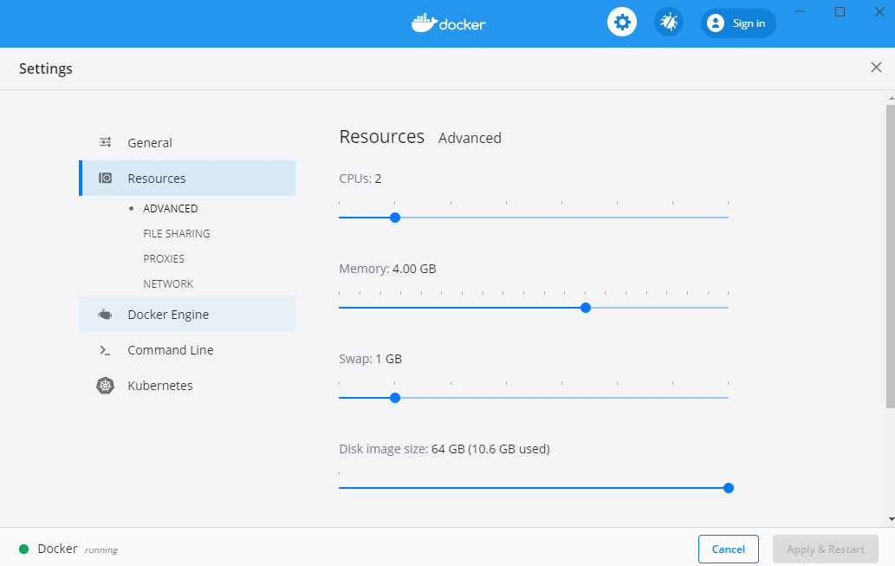

# **NEST with Elastic Search through Docker**

The initial goal with this project was to compare the 2 Elastic Search Libraries in .NET to determine advantages in use. Using Nuget data and Elastic Search engine, we made our own search page. This uses the basic version of Elastic Search, 7.8.

**About Nest**

NEST is a high level .NET Elastic Search Client that provides strongly typed one-to-one mapping .Net queries to Elastic Search queries. Due to that conversion, we expect an overhead which lead us to benchmark if it's a good compromise for more features and capabilities.

**Tested in:**
- Windows 10
- Visual Studio 2019

**Requirements:**

- [Docker Desktop for Windows](https://docs.docker.com/get-docker/)
- [Nuget Data](https://nusearch.blob.core.windows.net/dump/nuget-data-jul-2017.zip)
- 4GB RAM

## I. Installation

**I.A. DOCKER INSTALLATION**

Install Docker, open it, and go to settings. Go to Resource and set memory to about 4GB Ram.

To install, run in powershell/git bash the following on the docker folder containing the docker-compose.yml file.

    docker-compose up

This should setup 3 nodes for your elastic search and also Kibana, which would be accessible through http://localhost:5601.

You can go to Kibana Dev tools to verify this. Once there query the following and click on the query icon:

    GET /_cluster/health

You should get the following information confirming you have indeed 3 nodes. 

This is critical because we will be indexing a big number of documents.

**I.B. RUNNING THE INDEXER**

Extract the data on the same folder as the solution (not inside).

Open the solution and set the NuSearch.Indexer as the Startup Project. Build and run and you should be able to confirm success by seeing something similar below.

The process will create documents from the data that we have and will create an index with name 'nusearch'.

You can confirm the total from Kibana, using the query below:

    GET /nusearch/_count

The result should show as follows:

## II. Usage
To use, set the startup project to NuSearch.Web and Run. You should now see the Search Webpage.

Try entering a keyword and click on Search. It should return some results.

## III. Common Errors and Discussion

Initially this was run through a non-docker local setup. But for portability and ease of use, we contained our elastic-kibana stack to a docker container.

Or First attempt was to just connect the code to a ready-made [Elk stack container made by deviantony](https://github.com/deviantony/docker-elk). Apart from making adjustments to the connection as this repository was using a trial version (one with monitoring), it was easy to connect. 

However, we encountered some limitations, as we attempt to index our multiple documents. As we ran our code, we come accross the error 429, or too many requests error. It occurs when the number of requests to the Elasticsearch cluster exceeds the bulk queue size.

We determined that the write requests were just too many for one node to handle. So we decided to write our own docker-compose file, which will contain only the ones we need, i.e., a multiple node Elastic Search and Kibana.

## IV. In Progress

 1. Multi Text Search 
 2. Analyzers
 3. ElasticSearch.NET Comparison

This project was a fork from [NEST 7.x Example](https://github.com/elastic/elasticsearch-net-example/tree/7.x) which was used and modified for our NEST/Elastic Search Training.

*For questions, please email g.mortillero@arcanys.com.*
