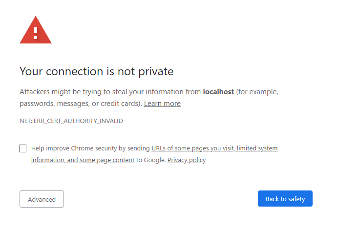
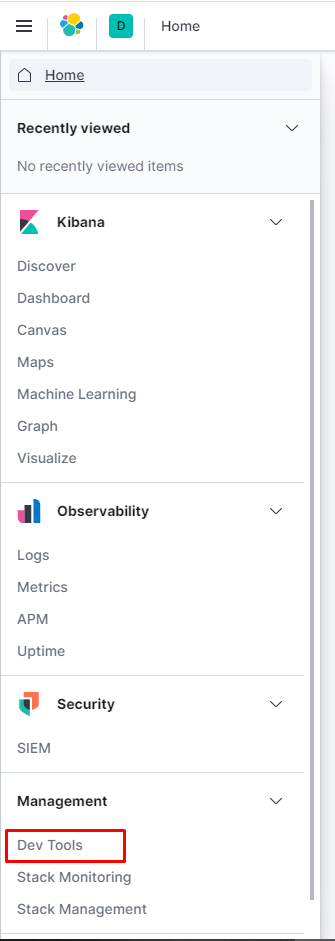

# **NEST with Elastic Search through Docker**

The initial goal with this project was to compare the 2 Elastic Search Libraries in .NET to determine advantages in use. Using Nuget data and Elastic Search engine, we made our own search page. This uses the basic version of Elastic Search, 7.8.

**About Nest**

NEST is a high level .NET Elastic Search Client that provides strongly typed one-to-one mapping .Net queries to Elastic Search queries. It takes advantage of specific .NET features to provide higher level abstractions such as auto mapping of CLR types. Due to that conversion, we expect an overhead which lead us to benchmark if it's a good compromise for more features and capabilities. 

**Tested in:**
- Windows 10
- Visual Studio 2019

**Requirements:**

- [Docker Desktop for Windows](https://docs.docker.com/get-docker/)
- [Nuget Data](https://nusearch.blob.core.windows.net/dump/nuget-data-jul-2017.zip)
- Cloned this repository, locally
- 4GB RAM

## I. DOCKER INSTALLATION
This tutorial heavily relies on elastic search's docker containers. To get that running, install Docker Desktop. You can download the installer from this [link](https://www.docker.com/products/docker-desktop). This is your gateway to **building your containerized Elastic Stack**.

Once you have it installed, open Docker Desktop, and go to settings. Go to Resource and set memory to about 4GB Ram. Our elastic stack container is a bit of a resource hog, so we'll expand Docker's capacity. This will prove helpful later once we start inserting our Data.

With the Ram changed and Docker Desktop running, you're now ready to move forward to build your own container.

## II. PREPARING THE ELASTIC STACK CONTAINER WITH SECURITY**

You can expand on this later, but for the purposes of this training, we'll stick with a basic authentication setup. Granted, we'll need to install some certificates. 

You'll need git bash or powershell to run the create certificates command. You'll have to navigate to the Docker directory, assuming you already cloned this repository. If not, clone it locally now. 

The best way to open the directory in powershell, is navigate to that Docker directory, and shift right click on an empty space. There will be multiple options, but what you need is the "**Open Powershell window here**".

Click that command and it should show you powershell (identified by the blue background) 
with the cursor on the directory already. You will need to run the command below.

    docker-compose -f create-certs.yml run --rm create_certs

To provide more information, this command downloads and extracts security certificates for your machine to run elastic search. Elasticsearch nodes and Kibana use these certificates to identify themselves when communicating with other nodes.

After you press enter, it should show you the following:

As you can see, this installs several certificates. We will be using 3 nodes and Kibana, so this installs a certificate for each. This is all configured on the **create-certs.yml** file. We'll reserve how it's coded for another time. 

That's it for the security certificates. Now we move on to the main event!

## III. BUILDING THE ELASTIC STACK CONTAINER**

Similar to the certificates installation, building our Elastic Stack container is easy. And similar to that installation, we will still need powershell or git bash. Whichever you prefer.

You should still be navigating towards the Docker folder. We are going to use the docker-compose.yml file. Inside you'll find configuration to install 3 Elastic Search nodes and Kibana. Don't get intimidated by the code inside. All you have to do is run the following to start building your container.

    docker-compose up -d

With those few words, this builds and turns on your elastic stack container. See picture below:

With your Elastic Stack running, we are now ready to utilize it. However, at the moment, Kibana won't connect properly. This is related mostly to the authentication. We'll discuss and learn how to setup the connection with your own personal authentication.

## IV. SECURING THE ELASTIC STACK AND CHANGING SETTINGS

The Elastic Stack Container you made is already configured with security. However, we will still need to personalize the authentication for your machine. To do this, we will generate your own passwords.

We will be running elasticsearch's auto setup for passwords. This is included with the installed container and as such it will be running from it.

However for us, we will still need to execute the command below through Powershell or Git Bash. Navigating to the Docker directory is no longer important.

    docker exec es01 /bin/bash -c "bin/elasticsearch-setup-passwords auto --batch --url https://es01:9200"

This runs a batch file that will generate passwords for your use, like the following:

Take note of the passwords, this is very important. To be specific, what we need are the **kibana_system and the elastic password** for our setup.

We will now be putting the passwords to where they are needed and we can get Kibana working. You'll need to navigate to the Docker folder, and on that folder is a file named .env. 

Don't be alarmed by the missing name, this is just how it is, it will look just like an extension. Edit that file in notepad and you will see a couple of Values. See screenshot below.

Look for **KIBANASYS_PASS** and update the value after the = to your **kibana_system password** from the generated passwords.

To update your changes, save the .env file. Since we updated settings, we will need to restart our docker container to apply it. To do that, we will need powershell or git bash again.

Once you have that open again, you'll need to navigate to the Docker Folder again. This is important because we'll need the docker-compose.yml file.

Run the following command to stop your container:

    docker-compose stop

Then to start your container again, run the command below:

    docker-compose up -d

This should now apply your changes. Note that other items on the .env file can be changed too. For now, if you want to change the ports, only if the default ports of 9200 and 5601 are used, you can do so by changing the values. In essence, you can set the ELASTIC_PORT to 9205.

Congratulations! That was a bit of a long tutorial but you've endured. You're ready to play around your container.

## V. TESTING KIBANA

It's time for us to muddle the waters of your newly built elastic stack. Your container should now be up and running. 

To use Kibana, open a browser and navigate to https://localhost:5601. If you have changed your KIBANA_PORT on .env file, change the 5601 to that. Also, notice that this url has https instead of http.

You might get this page below.

This is okay. Our certificicates our unsigned so this is expected. To continue, just click on the Advanced button and once the extra options appear, click on the Proceed to localhost (unsafe) link.

You'll be redirected to a login page. The username will be elastic and its password should be coming from the generated passwords.

Kibana is the user interface that you'll need to interact with Elastic Search. Think of it like SSMS to your SQL Server. There are lot of interesting features here but for the purpose of this tutorial, we will just be using the dev tools. This is where we will be running elastic search queries.

The dev tools is accessible through the menu, under Management.

Once everything is started, you can go to Kibana through https://localhost:{your current Kibana port on the .env file}. By default, this is 5601.

The login credentials can be found from the generated passwords still, the **elastic username and its corresponding password.**

As an example, we'll run a query to check on the health of our 3 nodes.

    GET /_cluster/health

To run the command, click on the Play button. This button will send the request to our elastic search server. Which in turn should be like this below.

As you can observer, our server is as good as green. This is critical because we will be indexing a big number of documents.

## VI. INDEXING THE DOCUMENTS
From the first mentioned requirements, you should've already downloaded the [Nuget Data](https://nusearch.blob.core.windows.net/dump/nuget-data-jul-2017.zip). If not, now's the perfect time. Should be around 2.5 GB.

Create a data folder on the same directory as the cloned local repository. The folder directory should be the structure below.

Once the data is full extracted and saved as the directory above suggests, it's time to open the solution. It should be located inside NESTTraining folder. The file is NuSearch.sln. Use Visual Studio 2019 to open this.

Once opened go to the NuSearch.Domain Module, go to appsettings.json. Since we setup a password to use our elastic search, we will have this application use our personal password as well. Set the password for user elastic from the generated passwords earlier. Also, if you changed the ports, update this to the same as the ELASTIC_PORT set in the .env file. Once updated, save the appsettings.json file.

Then, set up NuSearch.Indexer as the Startup Project. After which, build and run and the indexer should start indexing the documents from the raw data. It might take a few minutes. 

Once done, you should be able to confirm success by seeing something similar below.

Those files will now be index under the name '**nusearch**.'

With our elastic search nodes filled, let's confirm the total from Kibana. Similar to the healt query we used earlier, we'll enter the following command in dev tools and click the Play button.

    GET /nusearch/_count

The result should show as follows:

## VII. Usage
As part of the solution, we also prepared a fully useable web application that utilizes our elastic search server. To get this running, open the solution NuSearch.sln again on Visual Studio 2019.

Set the startup project to NuSearch.Web. This is the web application's code. Build this and Run. You should now see the Search Webpage.

Try entering a keyword and click on Search. It should return some results.

You have successfully taken your first step in the .NET Elastic Search World. Welcome!

## VIII. Common Errors and Discussion

Initially this was run through a non-docker local setup. But for portability and ease of use, we contained our elastic-kibana stack to a docker container.

Or First attempt was to just connect the code to a ready-made [Elk stack container made by deviantony](https://github.com/deviantony/docker-elk). Apart from making adjustments to the connection as this repository was using a trial version (one with monitoring), it was easy to connect. 

However, we encountered some limitations, as we attempt to index our multiple documents. As we ran our code, we come accross the error 429, or too many requests error. It occurs when the number of requests to the Elasticsearch cluster exceeds the bulk queue size.

We determined that the write requests were just too many for one node to handle. So we decided to write our own docker-compose file, which will contain only the ones we need, i.e., a multiple node Elastic Search and Kibana.

This project was a fork from [NEST 7.x Example](https://github.com/elastic/elasticsearch-net-example/tree/7.x) which was used and modified for our NEST/Elastic Search Training.

*For questions, please email g.mortillero@arcanys.com.*
